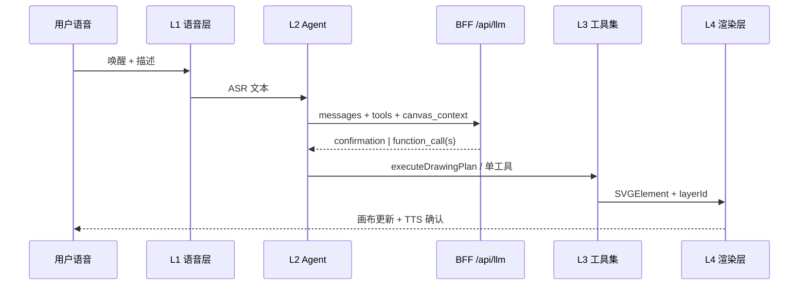

# TalkArt 分阶段矢量语音绘图改造计划

## 文档信息

| 字段 | 内容 |
|---|---|
| **版本** | v0.2.0-phase-plan |
| **日期** | 2026-06-12 |
| **状态** | 阶段一至六已交付（见 docs/qa/phased-capability-report.md） |
| **目标** | 以**纯语音**驱动**矢量绘图**，规避文生图（像素生成）路线，支撑课题四维度验证：纯语音交互、容错纠错、低延迟体验、复杂指令拆解 |
| **基线版本** | v0.1.0-mvp（15 工具、单步 Function Calling、px 语义坐标） |
| **方案选型** | **方案 C+**：矢量渲染为主 + `executeDrawingPlan` 批量编排 + 可选像素素材（`insertImage`） |
| **关联文档** | `docs/qa/capability-design.md`、`docs/architecture/module-design.md`、`docs/product-research/proposal-20260611-voice-svg-drawing-tool/06-feature-solution-design.md` |

---

## 一、课题背景与改造动机

### 1.1 课题四维度

| 维度 | 含义 | v0.1.0-mvp 现状 | 改造方向 |
|---|---|---|---|
| **纯语音** | 全程免手操作，唤醒→描述→确认→执行 | 已具备唤醒词、确认词、纠错词 | 强化演示模式、TTS 播报确认、语音 undo/export |
| **容错** | ASR 误识、意图歧义、执行失败可恢复 | 多轮确认 + 纠错词 | 规划级容错（plan 局部重试）、图层隔离、语音撤销 |
| **延迟** | 从说完到看见结果的等待感 | 单工具调用，复杂场景需多轮往返 | `executeDrawingPlan` 一次下发多步，BFF 支持多 tool call |
| **复杂拆解** | 「画一个方便面包装」类复合场景 | 单步工具，无图层/路径/mm | 图层模型、路径工具、编排工具、康师傅包装验证场景 |

### 1.2 方案 C+ 核心思路

```
用户语音 → Agent 理解意图 → 生成 DrawingPlan（步骤列表）
                              ↓
                    executeDrawingPlan（批量执行）
                              ↓
              矢量工具集（mm 精确坐标 + 语义兜底）
                              ↓
                    SVG 渲染 + 图层栈
                              ↓
              可选 insertImage（位图素材，非文生图）
```

- **矢量主**：所有几何、文字、路径均以 SVG 元素落地，可编辑、可导出矢量稿。
- **executeDrawingPlan**：Agent 将复杂描述拆解为有序步骤，客户端原子执行，减少 LLM 往返。
- **可选像素**：仅用于插入用户指定或预设素材图（logo、条码占位等），不调用文生图 API。

### 1.3 用户新思路：四层架构

```
┌─────────────────────────────────────────────────────────────┐
│  L1 语音层    唤醒 / ASR / TTS / 结束语 / 语音 undo-export   │
├─────────────────────────────────────────────────────────────┤
│  L2 Agent 层  多轮确认 / 意图拆解 / DrawingPlan 生成         │
├─────────────────────────────────────────────────────────────┤
│  L3 工具集层  ~30 工具分组 / executeDrawingPlan / mm 坐标系  │
├─────────────────────────────────────────────────────────────┤
│  L4 渲染层    图层栈 / SVG DOM / 历史栈 / 导出               │
└─────────────────────────────────────────────────────────────┘
```

**康师傅包装示例**（阶段六验收场景）：

> 「小智小智，画一个方便面包装盒正面：上方红色横幅写品牌名，中间一碗面插图区域，下方配料表文字区，整体宽 90 毫米高 120 毫米。」

拆解为：`setCanvasSize` → `createLayer` ×3 → `drawRect`（外框）→ `drawRect`（横幅）→ `drawText` → `insertImage`（面碗占位）→ `drawText`（配料表）→ 全部通过 `executeDrawingPlan` 一次提交。

---

## 二、总体架构

### 2.1 数据流



### 2.2 与 v0.1.0-mvp 的关键差异

| 能力 | v0.1.0-mvp | v0.2 目标 |
|---|---|---|
| 工具数量 | 15 | 阶段末 ~30（分阶段引入） |
| 调用模式 | 单次 1 个 tool call | 支持多 tool call + `executeDrawingPlan` |
| 坐标单位 | 仅 px + 语义 | mm 为主、px 兼容、语义兜底 |
| 图层 | 扁平 elements 数组 | `layerId` + 图层栈 |
| 路径 | 无 | `drawPath` / `drawPolyline` |
| 素材 | 无 | `insertImage` |
| System Prompt | 简单画布摘要 | 含 mm 换算、图层、plan 指引 |

---

## 三、阶段划分总表

| 阶段 | 名称 | 核心目标 | 预估工期 |
|---|---|---|---|
| **一** | 规划与 Schema 骨架 | 文档、坐标规范、工具总体规划、`executeDrawingPlan` 接口定义 | 3–5 天 |
| **二** | 批量执行与精确坐标 | Plan 执行器、BFF 多 tool call、mm→px 换算 | 5–7 天 |
| **三** | 路径与图层 | `drawPath`/`drawPolyline`、`layerId`、图层 CRUD | 5–7 天 |
| **四** | 纯语音演示模式 | TTS 确认、语音 undo/export、免触控演示链路 | 4–6 天 |
| **五** | 素材与样式增强 | `insertImage`、渐变、圆角增强 | 4–6 天 |
| **六** | 复杂场景验证 | 康师傅包装等设计稿场景、能力报告 | 5–7 天 |

---

## 四、各阶段详细说明

### 阶段一：规划与 Schema 骨架

**目标**：确立改造路线图与技术契约，不改动现有 15 工具运行时行为。

**计划支持的指令/工具能力**：

- 文档层定义全部 ~30 工具的名称、分组、引入阶段。
- `executeDrawingPlan` 的 TypeScript 接口与 JSON Schema 骨架（无完整执行器）。
- 坐标系规范草案（mm/px、原点、图层模型）。

**交付物**：

| 类型 | 路径 |
|---|---|
| 文档 | `docs/research/phased-implementation-plan.md`（本文档） |
| 接口 | `src/modules/drawing-tools/v2/execute-drawing-plan.types.ts` |
| Schema 骨架 | `src/modules/drawing-tools/v2/tool-schema-skeleton.ts` |

**验收标准**：

- [ ] 团队成员可仅凭本文档理解六阶段边界与依赖。
- [ ] `executeDrawingPlan` 入参/出参类型可被 TypeScript 编译通过。
- [ ] 工具总体规划表覆盖 8 大分组，每工具标注引入阶段。
- [ ] 与 `capability-design.md` 的「计划/实现/未完成原因」模板对齐。

**依赖上一阶段**：无（基于 v0.1.0-mvp 代码库）。

---

### 阶段二：批量执行与精确坐标

**目标**：解决**延迟**与**复杂拆解**的基础瓶颈——一次确认、多步落地。

**计划支持的指令/工具能力**：

| 类别 | 工具/能力 |
|---|---|
| 编排 | `executeDrawingPlan`（完整实现） |
| 画布 | `setCanvasSize`（mm 单位）、`setCanvasUnit` |
| 几何 | 现有 6 基础图形扩展 mm 坐标参数 |
| BFF | 返回 `tool_calls[]`（多调用），客户端顺序执行 |
| Agent | System Prompt 增加 mm 换算说明与 plan 示例 |

**交付物**：

- `src/modules/drawing-tools/v2/plan-executor.ts`
- `api/llm.ts` 多 tool call 解析
- `src/modules/drawing-tools/coordinate-utils.ts` 扩展 `mmToPx` / `pxToMm`
- `tests/plan-executor.test.ts`
- `docs/qa/capability-design.md` 更新阶段二条目

**验收标准**：

- [ ] 语音「画三个蓝色圆排成一行」一次确认后，plan 含 ≥3 步且全部渲染。
- [ ] 「画一个宽 50mm 高 30mm 的红色矩形」误差 ≤2px（96dpi 基准）。
- [ ] BFF 单次响应可携带 ≥5 个 tool call。
- [ ] 现有 15 工具单步调用仍向后兼容。

**依赖阶段一**：接口定义、坐标规范、工具命名约定。

---

### 阶段三：路径与图层

**目标**：支撑非矩形类和分区构图（包装分块、横幅、插图区）。

**计划支持的指令/工具能力**：

| 类别 | 工具 |
|---|---|
| 路径 | `drawPath`、`drawPolyline`、`drawPolygon` |
| 图层 | `createLayer`、`deleteLayer`、`renameLayer`、`setLayerVisibility`、`setLayerOrder`、`moveElementToLayer` |
| 元素 | 所有新建元素支持可选 `layerId` |
| 渲染 | 图层 z-index 排序、按层隐藏 |

**交付物**：

- `src/modules/drawing-tools/v2/path-tools.ts`
- `src/modules/drawing-tools/v2/layer-tools.ts`
- `src/store/canvas-slice.ts` 图层栈模型
- `src/modules/svg-renderer/` 按层渲染
- 路径/图层单元测试

**验收标准**：

- [ ] 「在背景层画一个圆角矩形，在文字层写标题」两层独立可见/隐藏。
- [ ] `drawPolyline` 绘制折线箭头轮廓（≥4 点）。
- [ ] LLM 工具 schema 中 `layerId` 为可选枚举（动态图层列表注入 context）。

**依赖阶段二**：`executeDrawingPlan` 批量写多图层、mm 定位。

---

### 阶段四：纯语音演示模式

**目标**：强化**纯语音**与**容错**体验，达到课题演示标准。

**计划支持的指令/工具能力**：

| 类别 | 能力 |
|---|---|
| TTS | 确认语播报、执行结果摘要播报 |
| 语音 | 「撤销」→ `undoAction`；「导出」→ `exportImage` |
| 演示模式 | 免点击全流程：唤醒→描述→语音确认→自动执行→TTS 反馈 |
| 容错 | Plan 单步失败时跳过/重试策略；语音「不对」回退到确认态 |

**交付物**：

- `src/modules/voice-input/TTSEngine.ts`
- `src/modules/voice-input/VoiceCommandRouter.ts`（undo/export 口令）
- `src/hooks/useDemoMode.ts`
- 演示脚本文档 `docs/qa/voice-demo-script.md`

**验收标准**：

- [ ] 演示模式全程无鼠标操作完成「画圆+改色+撤销+导出」。
- [ ] TTS 在确认态播报 AI 反问内容。
- [ ] 语音「撤销」与工具 `undoAction` 等价。

**依赖阶段二**：批量执行减少演示中断；阶段三可选（无图层也能演示）。

---

### 阶段五：素材与样式增强

**目标**：包装类场景插图区、品牌色渐变。

**计划支持的指令/工具能力**：

| 类别 | 工具 |
|---|---|
| 素材 | `insertImage`（url / dataUrl / 预设素材 id） |
| 样式 | `setFillGradient`、`setStrokeGradient` |
| 几何增强 | `drawRect` 的 `cornerRadius` mm 单位；`drawArc` |

**交付物**：

- `src/modules/drawing-tools/v2/asset-tools.ts`
- `src/modules/drawing-tools/v2/style-tools.ts`
- 预设素材清单 `public/assets/presets/`
- 渐变 SVG 渲染支持

**验收标准**：

- [ ] 「插入一碗面的图片在中间区域」通过 `insertImage` 落地（预设图或占位）。
- [ ] 红色到橙色线性渐变填充矩形。
- [ ] 素材缩放支持 mm 宽高。

**依赖阶段三**：图层分区放置插图；依赖阶段二：mm 定位。

---

### 阶段六：复杂包装设计稿场景验证

**目标**：课题结题级场景验证与能力报告。

**计划支持的指令/工具能力**：

- 康师傅包装正面完整拆解（见 1.3 示例）。
- `alignElements`、`distributeElements`（若阶段二/三未引入则本阶段补齐）。
- 能力矩阵实测与文档化。

**交付物**：

- `docs/qa/phased-capability-report.md`（四维度评分 + 场景录像脚本）
- E2E 测试 `tests/e2e/kangshifu-package.spec.ts`
- `docs/qa/capability-design.md` 全量更新

**验收标准**：

- [ ] 单条语音描述 + 一次确认，plan ≥8 步，包装稿视觉结构正确。
- [ ] 四维度各有 ≥3 条实测记录。
- [ ] 导出 SVG 可在 Illustrator / Figma 打开编辑。

**依赖阶段二～五**：全部能力就绪。

---

## 五、新工具集总体规划表

图例：**P1**=阶段一 · **P2**=阶段二 · **P3**=阶段三 · **P4**=阶段四 · **P5**=阶段五 · **P6**=阶段六

### 5.1 画布 / 图层（8）

| 工具名 | 说明 | 阶段 |
|---|---|---|
| `setCanvasSize` | 设置画布宽高（mm 或 px） | P2 |
| `setCanvasUnit` | 切换默认单位 mm/px | P2 |
| `setBackground` | 画布背景色/渐变 | P5 |
| `clearCanvas` | 清空画布 | 已有→P2 增强 layer 感知 |
| `createLayer` | 新建图层 | P3 |
| `deleteLayer` | 删除图层 | P3 |
| `renameLayer` | 重命名图层 | P3 |
| `setLayerVisibility` | 显示/隐藏图层 | P3 |
| `setLayerOrder` | 调整图层层级 | P3 |

### 5.2 几何（10）

| 工具名 | 说明 | 阶段 |
|---|---|---|
| `drawRect` | 矩形（含圆角） | 已有→P2 mm |
| `drawCircle` | 圆形 | 已有→P2 mm |
| `drawEllipse` | 椭圆 | 已有→P2 mm |
| `drawLine` | 线段 | 已有→P2 mm |
| `drawTriangle` | 三角形 | 已有→P2 mm |
| `drawArc` | 圆弧 | P5 |
| `drawPolygon` | 多边形（点列表） | P3 |
| `drawPolyline` | 折线 | P3 |
| `drawPath` | SVG path d | P3 |
| `drawArrow` | 箭头（线+标记） | P6 |

### 5.3 文字（2）

| 工具名 | 说明 | 阶段 |
|---|---|---|
| `drawText` | 单行文字 | 已有→P2 mm |
| `drawTextBlock` | 多行文字块（宽 mm + 对齐） | P6 |

### 5.4 编辑（9）

| 工具名 | 说明 | 阶段 |
|---|---|---|
| `selectElement` | 选择元素 | 已有 |
| `updateElement` | 更新属性 | 已有→P3 layer |
| `deleteElement` | 删除 | 已有 |
| `moveElement` | 移动 | 已有→P2 mm 偏移 |
| `scaleElement` | 缩放 | 已有 |
| `duplicateElement` | 复制 | 已有 |
| `moveElementToLayer` | 元素改层 | P3 |
| `alignElements` | 对齐 | P6 |
| `distributeElements` | 分布 | P6 |

### 5.5 素材（2）

| 工具名 | 说明 | 阶段 |
|---|---|---|
| `insertImage` | 插入位图素材 | P5 |
| `updateImage` | 调整已插入图片 | P5 |

### 5.6 样式（3）

| 工具名 | 说明 | 阶段 |
|---|---|---|
| `setFillGradient` | 填充渐变 | P5 |
| `setStrokeGradient` | 描边渐变 | P5 |
| `setOpacity` | 透明度 | P5 |

### 5.7 编排（2）

| 工具名 | 说明 | 阶段 |
|---|---|---|
| `executeDrawingPlan` | 批量执行步骤列表 | P1 定义 · P2 实现 |
| `groupElements` | 元素编组 | P6 |

### 5.8 历史 / 导出（3）

| 工具名 | 说明 | 阶段 |
|---|---|---|
| `undoAction` | 撤销 | 已有→P4 语音 |
| `redoAction` | 重做 | P4 |
| `exportImage` | 导出 svg/png | 已有→P4 语音 |

**合计**：约 **39** 个工具名（含已有 15 个演进）；阶段二起 Agent 活跃工具约 **12–15** 个，阶段六全量注册 ~30 个。

---

## 六、坐标系与 LLM 理解规范（草案）

### 6.1 单位与换算

| 规则 | 说明 |
|---|---|
| **默认单位** | 设计稿语义用 **mm**；屏幕渲染用 **px** |
| **DPI 基准** | 96 DPI（Web 标准）：`1 mm = 96 / 25.4 ≈ 3.7795 px` |
| **LLM 输出** | 优先 `unit: "mm"` + 数值；兼容裸数字视为 mm（阶段二起） |
| **语义兜底** | 保留 v0.1 的 `semantic` 位置/大小，与 mm 互斥时 mm 优先 |

### 6.2 原点与轴向

```
(0,0) ──────────────► +X (右)
  │
  │   画布左上角为原点
  ▼
 +Y (下)
```

- 矩形、`drawText`：`(x, y)` 为**左上角**。
- 圆/椭圆：`(cx, cy)` 为**中心**（与现有 v0.1 一致）。
- `drawPath`：路径坐标相对于画布原点。

### 6.3 图层模型（Layer Model）

```typescript
interface Layer {
  id: string;           // 如 "layer-bg", "layer-text"
  name: string;         // 中文名，如 "背景层"
  visible: boolean;
  zIndex: number;       // 越大越靠前
}

interface SVGElementV2 {
  id: string;
  type: string;
  layerId: string;      // 默认 "layer-default"
  props: Record<string, unknown>;
}
```

- LLM `canvas_context` 注入：`layers[]` + 每层元素摘要。
- 未指定 `layerId` 时落入 `layer-default`。

### 6.4 executeDrawingPlan 契约

```typescript
interface DrawingPlanStep {
  tool: string;                    // 工具名
  args: Record<string, unknown>;   // 参数
  label?: string;                  // 步骤说明，便于 TTS / 调试
}

interface ExecuteDrawingPlanInput {
  planId?: string;
  steps: DrawingPlanStep[];
  atomic?: boolean;                // true：任一步失败则整体回滚
}

interface ExecuteDrawingPlanResult {
  success: boolean;
  planId: string;
  completedSteps: number;
  results: ToolResult[];
  errors?: { stepIndex: number; error: string }[];
}
```

### 6.5 System Prompt 补充要点（阶段二起）

1. 画布尺寸以 mm 告知 LLM，并附 px 换算结果。
2. 复杂场景优先输出 `executeDrawingPlan`，而非多个独立回合。
3. 图层命名使用用户语言（「背景层」「标题层」）。
4. 禁止调用文生图；插图使用 `insertImage` + 预设 id。

---

## 七、设计文档交付要求

### 7.1 三态跟踪模板

延续 `docs/qa/capability-design.md` 格式，每个能力条目：

| 指令/工具 | 计划 | 实现 | 说明 |
|---|---|---|---|
| `executeDrawingPlan` | ✅ | ⬜ | 阶段一仅接口，阶段二实现 |

### 7.2 阶段交付时必更新文档

| 文档 | 更新时机 |
|---|---|
| `docs/qa/capability-design.md` | 每阶段结束 |
| `docs/research/phased-implementation-plan.md` | 计划变更时 |
| `docs/qa/phased-capability-report.md` | 阶段六 |

### 7.3 未完成原因模板

```markdown
| 功能 | 计划优先级 | 未实现原因 |
|---|---|---|
| {功能名} | P{n} | {技术阻塞 / 依赖未就绪 / 留待阶段 X} |
```

---

## 八、与 v0.1.0-mvp 15 工具的关系

### 8.1 演进策略

| 策略 | 工具 |
|---|---|
| **保留增强** | 15 个现有工具：增加 mm 参数、`layerId`，不删改名 |
| **拆分** | 无（避免破坏 v0.1 测试） |
| **新增** | `executeDrawingPlan`、路径、图层、素材、样式、编排类 |
| **废弃** | 无硬性废弃；v0.2 全量后 v0.1 语义坐标标记 `deprecated` 于 schema description |

### 8.2 时间表

| 时间点 | 状态 |
|---|---|
| 阶段一～二 | v0.1 15 工具为**唯一运行时**；v2 schema 仅骨架 |
| 阶段二完成 | `TOOL_DEFINITIONS_V2` 与 v0.1 并存，feature flag 切换 |
| 阶段四 | 演示模式默认 v2 |
| 阶段六 | v0.1 schema 标记 deprecated，v2 为默认 |
| v0.3（课题后） | 移除 v0.1 专用代码路径（若测试已全部迁移） |

### 8.3 文件布局

```
src/modules/drawing-tools/
├── tool-definitions.ts          # v0.1（现行）
├── basic-shapes.ts              # v0.1 实现
├── v2/
│   ├── tool-schema-skeleton.ts  # 阶段一：全量 schema 骨架
│   ├── execute-drawing-plan.types.ts
│   ├── plan-executor.ts         # 阶段二
│   ├── path-tools.ts            # 阶段三
│   └── ...
```

---

## 九、风险与缓解

| 风险 | 影响 | 缓解 |
|---|---|---|
| LLM 一次生成过长 plan | 执行失败、超时 | 限制 steps ≤20；分批 plan |
| mm 与语义坐标混用 | 定位漂移 | 参数校验互斥；Prompt 示例 |
| 多 tool call 提供商差异 | BFF 兼容性 | 统一转为 `tool_calls[]` 数组 |
| 图层状态膨胀 | context 超长 | 分层摘要，仅传可见层 |
| 浏览器 TTS 质量参差 | 演示效果 | 可配置关闭 TTS，保留字幕 |

---

## 十、阶段分支与 Git 约定

| 阶段 | 分支名 | PR 标题格式 |
|---|---|---|
| 一 | `phase-1` | `阶段一: 规划与 Schema 骨架` |
| 二 | `phase-2` | `阶段二: 批量执行与精确坐标` |
| … | `phase-N` | 同上 |

提交信息模板：

```
阶段N: 简短标题

本次实现：...
遇到的问题：...
如何解决：...
修改文件：...
```

---

## 更新记录

| 日期 | 版本 | 更新内容 |
|---|---|---|
| 2026-06-12 | v0.2.0-phase-plan | 初版：六阶段划分、工具总体规划、坐标规范草案 |
